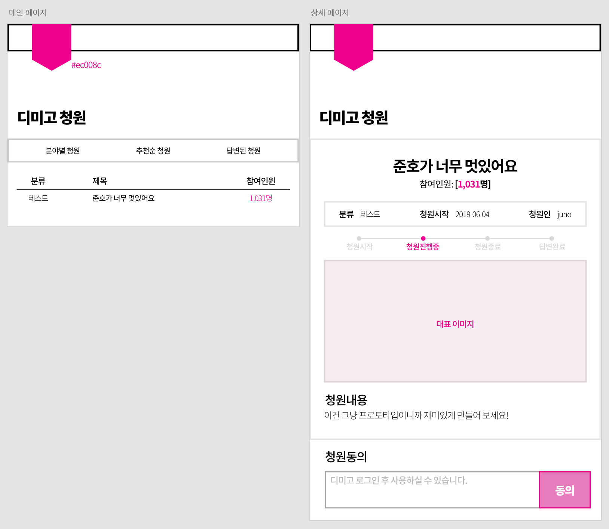

# Dimigo-Petitions [](https://www.python.org/downloads/release/python-370)
Python의 비동기 웹 프레임워크인 Sanic을 사용; 프로젝트 구조와 문서화에 신경쓰며 개발하는 것이 목표

## Prototype Design


## API 목차

- [로그인](#로그인)
  - [디미고 계정으로 로그인](#디미고-계정으로-로그인)
- [청원](#청원)
  - [청원 생성하기](#청원-생성하기)
  - [청원 조회하기](#청원-조회하기)
  - [청원 수정하기](#청원-수정하기)
  - [청원 삭제하기](#청원-삭제하기)

## 로그인

### 디미고 계정으로 로그인
- `POST /auth/login`
- 처음 로그인하는 사용자의 경우, 공개 디미고인 API를 이용해서 사용자 정보를 가져옴

#### request
```json
{
    "id": "test",
    "password": "test"
}
```

- `id`: 사용자 아이디
- `password`: 사용자 비밀번호

#### response
```json
{
    "token": "(JWT 토큰)",
    "refresh_token": "-",
    "user": {
        "idx": 0,
        "name": "test",
        "grade": "1",
        "klass": "5",
        "number": "20",
        "serial": "1520",
        "photo": null,
        "email": "test@civar.dev",
        "user_type": "S"
    }
}
```

- `token`: JWT 토큰
- `refresh_token`
- `user`
  - `idx`: 디미고인 계정에서의 idx(무시)
  - `name`: 학생 이름
  - `grade`: 학생 학년
  - `klass`: 학생 반
  - `number`: 학생 번호
  - `serial`: 학번
  - `photo`: 학생 사진
  - `email`: 학생 이메일
  - `user_type`: 회원 종류(학생은 `S`)


## 청원

### 청원 생성하기
- `POST /post/`

#### request
 
#### response
```json
{
    "post_id": "5cf268f6fff7002fc90b3ddf"
}
```

### 청원 조회하기
- `GET /post/{post_id}`

### 청원 수정하기
- `PUT /post/{post_id}`

### 청원 삭제하기
- `DELETE /post/{post_id}`
